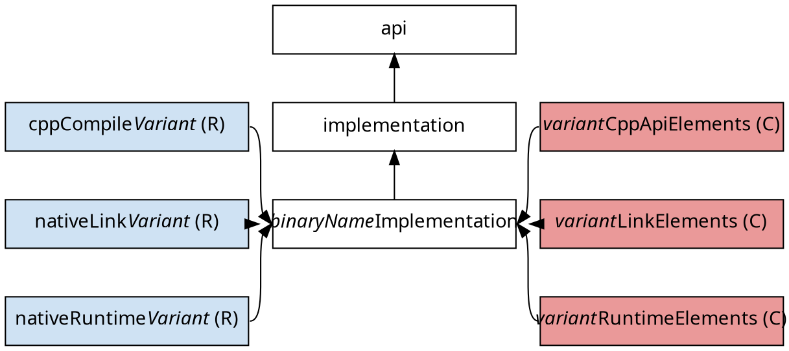
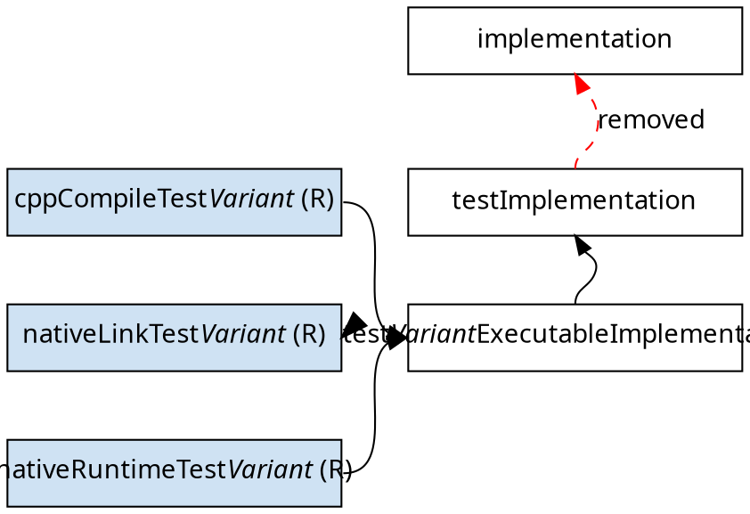

# Nokee Native Companion Plugin

The native companion plugin provides improvements to the core native plugins (i.e. `cpp-application`, `cpp-library`, and `cpp-unit-test`).
Head over to the [feature](#feature) section to learn more about what this plugin provides.

## Usage

### Project

The plugin react to the `cpp-library` and `cpp-application` together with [feature flags](#feature).
On its own, the plugin does nothing.

```groovy
plugins {
	id 'dev.nokee.native-companion' version '<version>'
	id 'cpp-application' // or 'cpp-library'
}
```

### Settings

On the settings script, the plugin will apply itself to [all projects](#project).

```groovy
plugins {
	id 'dev.nokee.native-companion' version '<version>'
}
```

### Init Script

The init script applies the plugin to [all builds](#settings).

```groovy
// Adds the plugin to the build classpath
buildscript {
	dependencies {
		classpath 'dev.nokee.native-companion:dev.nokee.native-companion.gradle.plugin:<version>'
	}
}

// Apply the plugins to all builds
gradle.beforeSettings { settings ->
	settings.apply plugin: 'dev.nokee.native-companion'
}
```

Use the provided init script to enable the plugin globally.
This usage scenario should only be used for testing purpose.
We **do not recommend** using the plugin by dropping the init script inside your `~/.gradle/init.d` or your custom distribution.

## Tasks

The companion plugin replace the following task:

* `compile<Variant>Cpp` - [CppCompile]({ref-javadoc-CppCompile})

  Replace **only** `CppBinary#compileTask`.
  The new task has several improvements, [per-source options]({ref-javadoc-CppCompileTask-source}), incremental after failure, compiler argument providers, properties for optimized, debuggable, position independent code and macros.

### Lifecycle Tasks

* `<variant>Objects`

  Depends on: respective `CppBinary#objects`

  Requires: `objects-lifecycle-tasks` feature

## Shadow Properties

Note that all consumer of the shadowed properties are rewired to be aware of the concept.
Visit [Shadow Property chapter](TODO) to learn more about the concept.
When any core native plugin applied:

- `CppBinary#optimized`: rewired into consumable and resolvable configuration and compile task
- `CppBinary#debuggable`: rewired into consumable and resolvable configuration, compile and link task
- `CppBinary#objects`: rewired into link task and reflect the true compile task object files (when feature `native-task-object-files-extension` enabled) and collect all compile tasks objects (when feature `compile-tasks-extension` enabled).
- `CppBinary#compileIncludePath`: rewired into compile task
- `CppComponent#cppSource`: rewired into `CppBinary#cppSource`
- `CppBinary#cppSource`: rewired into compile task

## Features

The plugin use feature flags to enable/disable functionalities.
We can enable/disable features via Gradle properties: all feature using `dev.nokee.native-companion.all-features.enabled` or individual features using `dev.nokee.native-companion.<feature-name>.enabled` (i.e. `dev.nokee.native-companion.fix-for-public-headers.enabled`).
We can also enable each features via the [`NativeCompanionExtension#enableFeaturePreview(<feature-name>)`](#TODO) Project extension.

Here's summary of all features available:

- _(disabled)_ [**native-task-object-files-extension**](#feature-native-task-object-files-extension): Adds object files property concept to native compile tasks.
- _(disabled)_ [**compile-tasks-extension**](#feature-compile-tasks-extension): Adds compile tasks view concept to C++ binaries.
- _(disabled)_ [**binary-task-extensions**](#feature-binary-task-extensions): Conveniences for configuring binary tasks (i.e. compile task, etc.) without realizing them.
- _(disabled)_ [**fix-for-gradle-29492**](#feature-fix-for-gradle-29492): Fixes [gradle/gradle#29492](https://github.com/gradle/gradle/issues/29492) regarding inability to track relative path of native compilation units.
- _(disabled)_ [**fix-for-gradle-29744**](#feature-fix-for-gradle-29744): Fixes [gradle/gradle#29744](https://github.com/gradle/gradle/issues/29744) regarding header dependencies sensitivity to source ordering.
- _(disabled)_ [**fix-for-gradle-34152**](#feature-fix-for-gradle-34152): Fixes [gradle/gradle#34152](https://github.com/gradle/gradle/issues/34152) regarding incomplete header discovery when encountering header cycle or duplicated headers and macro includes.
- _(disabled)_ [**fix-for-public-headers**](#feature-fix-for-public-headers): Propagates generated headers' task dependencies and allows multiple public headers.
- _(disabled)_ [**fix-for-version-catalog**](#feature-fix-for-version-catalog): Accepts version catalog dependencies in native dependency buckets.
- _(disabled)_ [**incremental-compilation-after-failure**](#feature-incremental-compilation-after-failure): Conserves incremental compilation after compile task failure.
- _(disabled)_ [**objects-lifecycle-tasks**](#feature-objects-lifecycle-tasks): Adds lifecycle task to assemble a component's objects.
- _(disabled)_ [**multiplatform-publishing**](#feature-multiplatform-publishing): Replace core publishing with Nokee's multiplatform publishing.
- _(disabled)_ [**overlinking-avoidance**](#feature-overlinking-avoidance): Avoid overlinking by disabling "second-level" dependencies during linking.

### Feature: native-task-object-files-extension

Adds `objectFiles` extension on all `AbstractNativeCompileTask` that matches the object files produced in `objectFileDir`.
The object files directly correlate to the compilation unit.
For example, if the builds happen to produce duplicated object files in the `objectFileDir`, only the actual object files produced by the task would match.

### Feature: compile-tasks-extension

Adds `compileTasks` extension on all `CppBinary` that provide a view over all compile tasks participating in the compilation of the C++ binary.
By default, the extension includes the default `CppBinary#compileTask`.
Developers are encourage to include additional compile task, i.e. C compilation task, to the view as the plugin configure the `CppBinary#objects` shadow property with all object files produced by the compile tasks.
We rewire all `CppBinary#objects` consumer to be aware of the shadow property.

### Feature: binary-task-extensions

Under evaluation, [contact us](mailto:support@nokee.dev) for more information.

### Feature: fix-for-gradle-29492

Fixes [gradle/gradle#29492](https://github.com/gradle/gradle/issues/29492) regarding inability to track relative path of native compilation units.
Essentially, if only a compilation unit's relative path change, core Gradle native tasks wrongly consider this scenario as up-to-date.

### Feature: fix-for-gradle-29744

Fixes [gradle/gradle#29744](https://github.com/gradle/gradle/issues/29744) regarding header dependencies sensitivity to source ordering.
The plugin provide an equivalent fix **only** for affected Gradle version.
The Gradle team fixed the particular issue in Gradle 8.11 and later.

### Feature: fix-for-gradle-34152

Fixes [gradle/gradle#34152](https://github.com/gradle/gradle/issues/34152) regarding incomplete header discovery when encountering header cycle or duplicated headers and macro includes.
The plugin provide fix for all Gradle version affected.

### Feature: fix-for-public-headers

Propagate the `CppLibrary#publicHeaders` task dependencies to consumers (i.e. generated headers).
It fixes [gradle/gradle-native#994](https://github.com/gradle/gradle-native/issues/994) by backporting [gradle/gradle#26703](https://github.com/gradle/gradle/pull/26703).

Also, allows multiple public headers directories on `CppLibrary#publicHeaders`.
The plugin configures Gradle to pass along single public header directory.
For multiple public header directories, the plugin sync them into a single directory and pass along that directory.
The sync task in question is an implementation detail and users should not depend on it.

### Feature: fix-for-version-catalog

Under evaluation, [contact us](mailto:support@nokee.dev) for more information.

### Feature: incremental-compilation-after-failure

Conserves incremental compilation after a controlled compilation failure.
By design, Gradle performs a full rebuild when any non-incremental properties changes.
A compilation failure often result in some changed outputs.
As Gradle doesn't perform any output snapshotting when a task fails, it treats this particular _controlled failure_ as a non-incremental change to its properties.
The following task execution will result in a full rebuild.
The feature ensure a controlled failure is safely handled by Gradle to prevent breakage of the incremental compilation.

### Feature: objects-lifecycle-tasks

Adds `<variant>Objects` lifecycle tasks to all C++ binaries.
It's the most efficient target to force the whole compilation phase of a project for faster developer feedback.
It relies on `CppBinary#objects` (and its shadow alternative) to build the task graph.
Any native compile tasks added to the `CppBinary#compileTasks` view will be automatically wired to the lifecycle target.

### Feature: multiplatform-publishing

Uses Nokee's multiplatform publishing plugin instead of the core native Maven publish configuration.
The multiplatform publishing plugin allow attributes mutation of the platform's publication as well as providing additional variants (i.e. tests or SWIG elements).

### Feature: overlinking-avoidance


## Dependency Management



### C++ Unit Test Component

In the presence of the `cpp-unit-test` plugin, the companion detached the test suite's `implementation` dependency scope from the tested component's `implementation` dependency scope to favor a normal dependency.



## Contributed Extensions

The plugin provide a Project extension named `nativeCompanion` of type [`NativeCompanionExtension`](https://github.com/nokeedev/nokee-companion/blob/main/src/main/java/dev/nokee/companion/NativeCompanionExtension.java).

### Compile Tasks

Requires: `compile-tasks-extension` feature

The companion plugin adds [`compileTasks` extension]({ref-javadoc-CompileTasks}) to each C++ binary (i.e. `CppBinary`).
This allows more tasks to participate in the compilation of the binary, see mixing [C language]({ref-sample-cpp-with-c-sources}) or [Assembly language]({ref-sample-cpp-with-assembly-sources}) with a C++ binary samples.

### Tested Component Dependency Modifier

When a project applies `cpp-unit-test` plugin, the companion plugin adds [`testedComponent` dependency modifier]({ref-javadoc-TestedComponentDependency.Modifier}) to `Project#dependencies` and `CppTestExecutable#dependencies`.
The modifier allows selection of the _test elements_ for the unit test integration with the production component.
See it in action in [this sample]({ref-sample-cpp-unit-test-tested-component-integration}).

## DSL Support

### Groovy DSL

Each `CppBinary` has their respective `TaskProvider`'s configure method to avoid realizing the tasks in order to configure them:

- `CppBinary`: configure method `compileTask {}` which delegate to `CppCompile`
- `ComponentWithExecutable`: configure method `linkTask {}` which delegate to `LinkExecutable`
- `ComponentWithSharedLibrary`: configure method `linkTask {}` which delegate to `LinkSharedLibrary`
- `ComponentWithStaticLibrary`: configure method `createTask {}` which delegate to `CreateStaticLibrary`
- `ComponentWithInstallation`: configure method `installTask {}` which delegate to `InstallExecutable`
- `CppTestExecutable`: configure method `runTask {}` which delegate to `RunTestExecutable`

- `CppBinary#dependencies`: `implementation(notation)` and `implementation(moduleNotation) {}` bucket
- `CppComponent#dependencies`: `implementation(notation)` and `implementation(moduleNotation) {}` bucket
- `CppLibrary#dependencies`: `api(notation)` and `api(moduleNotation) {}` bucket

## Publishing

- `components.cpp`

  Requires: `multiplatform-publishing` feature

  A [`SoftwareComponent`]({ref-javadoc-SoftwareComponent}) for publishing the production C++ component (e.g. `application` or `library`) and its C++ binaries.
  Visit the [`multiplatform-publishing` plugin reference chapter](TODO) to learn more.


[ref-javadoc-SoftwareComponent]: https://docs.gradle.org/current/javadoc/org/gradle/api/component/SoftwareComponent.html
[ref-javadoc-CppCompileTask-source]: TODO
[ref-javadoc-TestedComponentDependency]: https://github.com/nokeedev/nokee-companion/blob/main/src/main/java/dev/nokee/companion/TestedComponentDependency.java
[ref-javadoc-CppCompile]: https://github.com/nokeedev/nokee-companion/blob/main/src/main/java/dev/nokee/language/cpp/tasks/CppCompile.java
[ref-javadoc-CompileTasks]: https://github.com/nokeedev/nokee-companion/blob/main/src/main/java/dev/nokee/companion/CompileTasks.java
[ref-sample-cpp-with-c-sources]: https://github.com/nokeedev/nokee-companion/tree/main/samples/cpp-with-c-sources
[ref-sample-cpp-with-assembly-sources]: https://github.com/nokeedev/nokee-companion/tree/main/samples/cpp-with-assembly-sources
[ref-javadoc-TestedComponentDependency.Modifier]: https://github.com/nokeedev/nokee-companion/blob/main/src/main/java/dev/nokee/companion/TestedComponentDependency.java
[ref-sample-cpp-unit-test-tested-component-integration]: https://github.com/nokeedev/nokee-companion/tree/main/samples/cpp-unit-test-tested-component-integration
